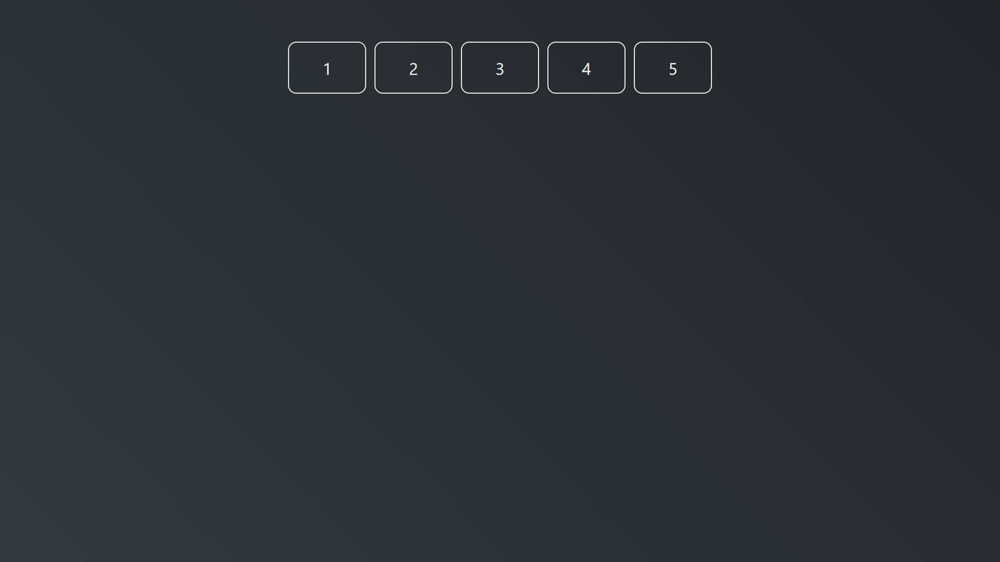
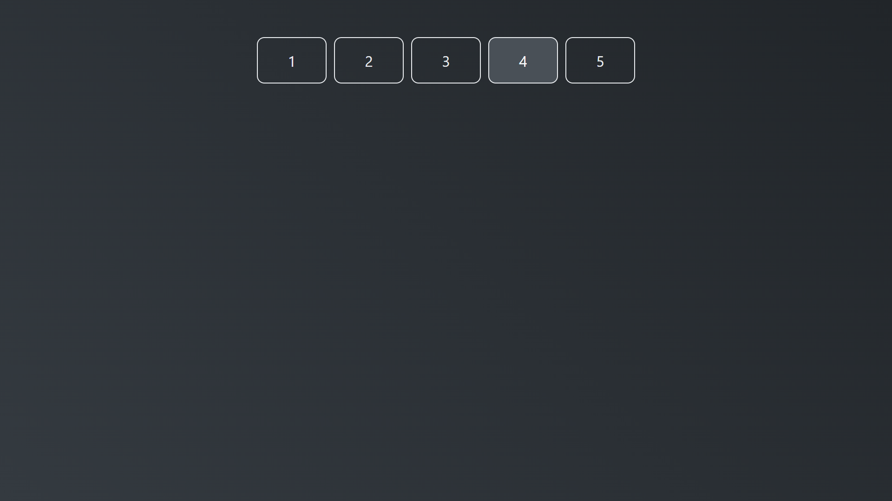
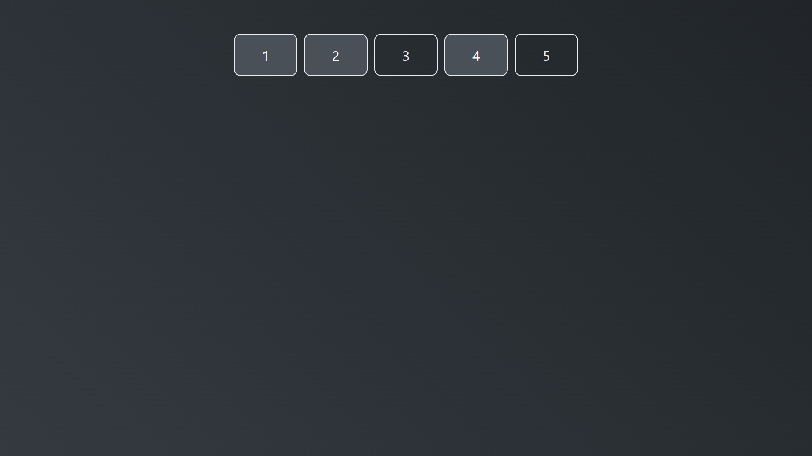

# Multiple Selector

Exemplo mais complexo de aplicação de useReducer, no qual a intenção e criar um reducer que facilite a implementação de seletores múltiplos. Neste exemplo, como pode ver na imagem a seguir, temos 5 caixas com números, cada uma delas possui o evento onClick e, ao ser ativado, irá selecionar a caixa. Caso esteja com o ctrl ou shift pressionado, poderá selecionar mais de 1 ao mesmo tempo, inclusive todos, do contrário, selecionará somente 1.

Figura 01 - Página inicial do exemplo de múltiplos seletores com reducer.

Figura 02 - Selecionando somente com o click do mouse

Figura 03 - Selecionando com o ctrl pressionado

## Links dos arquivos principais

1. [Arquivo de criação da função do reducer](./src/multipleSelectorReducer/index.js);
2. [Arquivo com as constantes implementadas no reducer e que podem ser chamadas](./src/multipleSelectorReducer/actions-type.js);
3. [Arquivo onde o reducer é implementado](./src/App.js)
